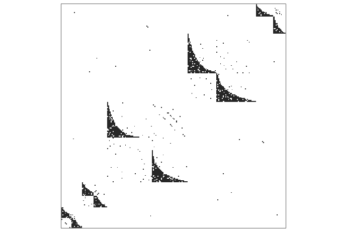

Change point analysis on networks
================

Libraries

``` r
#devtools::install::github("cboettig/NetGen")
library(tidyverse)
library(graphkernels)
library(igraph)
library(NetGen)
```

Data

``` r
# A list of 36 networks
load("data/networks/baci_networks_years.Rdata")
```

And here we go:

``` r
tidy_nets <- 
        map2_df(nets, names(nets), function(x,y){
        meta <-  strsplit(y, "\\.")[[1]]
        tibble(location = meta[[1]],  year = meta[[2]], network = list(as.data.frame(x)))
})


tidy_nets
```

    ## # A tibble: 36 x 3
    ##    location year  network               
    ##    <chr>    <chr> <list>                
    ##  1 Barger   2006  <data.frame [8 × 13]> 
    ##  2 Barger   2007  <data.frame [7 × 23]> 
    ##  3 Barger   2008  <data.frame [8 × 23]> 
    ##  4 Barger   2009  <data.frame [9 × 14]> 
    ##  5 Barger   2011  <data.frame [7 × 9]>  
    ##  6 Barger   2012  <data.frame [11 × 21]>
    ##  7 Barger   2013  <data.frame [19 × 36]>
    ##  8 Barger   2014  <data.frame [9 × 25]> 
    ##  9 Butler   2007  <data.frame [8 × 15]> 
    ## 10 Butler   2008  <data.frame [7 × 15]> 
    ## # ... with 26 more rows

``` r
graphs <- tidy_nets %>% 
        filter(location == "Barger") %>% 
        pull(network) %>% 
        lapply(igraph::graph_from_incidence_matrix)
```

``` r
output <- graphkernels::CalculateGraphletKernel(graphs, par=3)
```

``` r
yrs <- tidy_nets %>%  filter(location == "Barger") %>% pull(year)

rownames(output) <-  yrs
colnames(output) <- yrs
as.data.frame(output) %>% 
        rownames_to_column("year") %>%  
        tidyr::gather(start_year, value, -year) %>%
        ggplot() + 
        geom_tile(aes(start_year, year, fill = value))
```

<!-- -->

-----

# Simulated Data

``` r
time <- c(rep(10,5), rep(20, 5))

i = 1
graphs <- lapply(time, function(i){ 
        
        x = netgen(n_modav = c(250, 25), 
                  cutoffs = c(30, 10), 
                  net_type = 41, # bi-partite nested
                  net_degree = i,
                  net_rewire = c(0.01,0.1))
})
```

    ## 
    ## module count = 4 
    ## average degree = 9.012 
    ## average module size = 62.5 
    ## number of components = 2 
    ## size of largest component = 211

    ## 
    ## module count = 3 
    ## average degree = 8.852 
    ## average module size = 83.3333333333333 
    ## number of components = 1 
    ## size of largest component = 250

    ## 
    ## module count = 5 
    ## average degree = 8.724 
    ## average module size = 50 
    ## number of components = 2 
    ## size of largest component = 213

    ## 
    ## module count = 6 
    ## average degree = 8.228 
    ## average module size = 41.6666666666667 
    ## number of components = 3 
    ## size of largest component = 187

    ## 
    ## module count = 4 
    ## average degree = 9.248 
    ## average module size = 62.5 
    ## number of components = 1 
    ## size of largest component = 250

    ## 
    ## module count = 4 
    ## average degree = 14.2 
    ## average module size = 62.5 
    ## number of components = 2 
    ## size of largest component = 218

    ## 
    ## module count = 5 
    ## average degree = 14.028 
    ## average module size = 50 
    ## number of components = 1 
    ## size of largest component = 250

    ## 
    ## module count = 4 
    ## average degree = 15.636 
    ## average module size = 62.5 
    ## number of components = 1 
    ## size of largest component = 250

    ## 
    ## module count = 6 
    ## average degree = 11.872 
    ## average module size = 41.6666666666667 
    ## number of components = 1 
    ## size of largest component = 250

    ## 
    ## module count = 4 
    ## average degree = 14.796 
    ## average module size = 62.5 
    ## number of components = 1 
    ## size of largest component = 250

``` r
adj_plot(graphs[[1]])
```

<!-- -->

``` r
adj_plot(graphs[[10]])
```

<!-- -->

``` r
output <- graphkernels::CalculateGraphletKernel(graphs, par=3)
```

``` r
rownames(output) <- 2001:2010
colnames(output) <- 2001:2010
as.data.frame(output) %>% 
        rownames_to_column("year") %>%  
        tidyr::gather(start_year, value, -year) %>%
        ggplot() + 
        geom_tile(aes(start_year, year, fill = value))
```

<!-- -->
